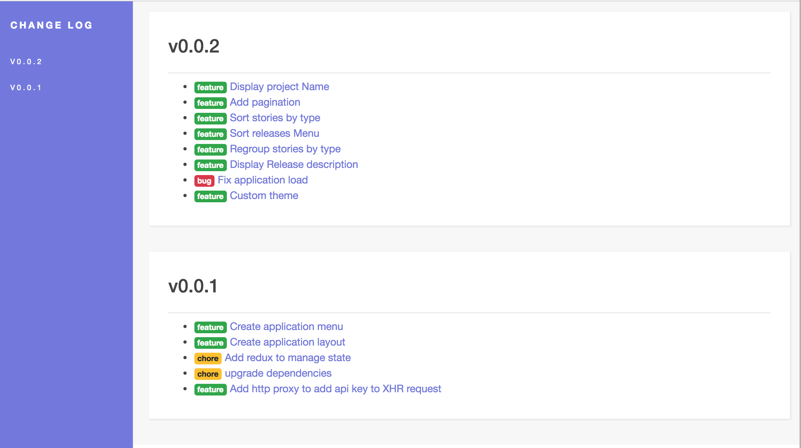

# PivotalTracker ChangeLog

### A [React](https://reactjs.org/) Application to display a beautiful Changelog for every release of your PivotalTracker projects




## Get Started

### 1. System Requirements

* Globally installed [node](https://nodejs.org/en/)
* Globally installed [YARN](https://yarnpkg.com/en/) (Optional)

### 2. Installation

On the command prompt run the following commands

```sh
$ git clone git@github.com:afadil/pivotaltracker-changelog.git

$ cd pivotaltracker-changelog

$ yarn (preferred)
  or
  npm install
```

#### Environment variables
Export your PivotalTracker API access Key. See [Pivotal API token](https://www.pivotaltracker.com/help/articles/api_token/) to get your Key

```sh
$ export PIVOTAL_KEY=[YOUR_PIVOTAL_KEY_HERE]
```

```sh
$ cp .env.sample .env
```

Edit `.env` file (This file is not tracked by git) and Change REACT_APP_PROJECT_CODE with your PivotalTracker project ID

```
REACT_APP_PROJECT_CODE=1234567
```


### 3. Run
Launch the application and the proxy server

```sh
$ npm run dev
```
Ou

```sh
$ yarn dev
```
